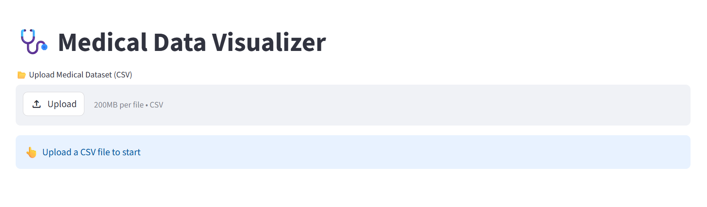
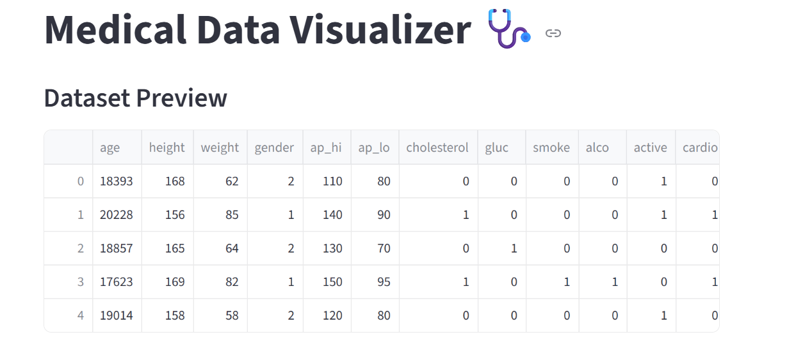
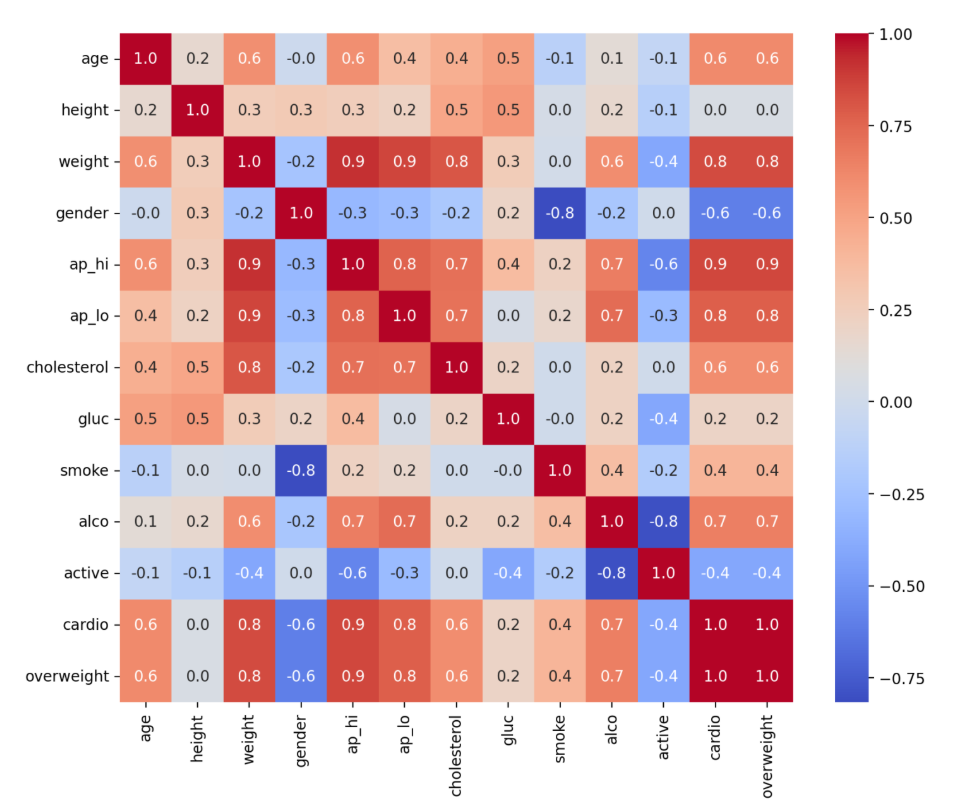
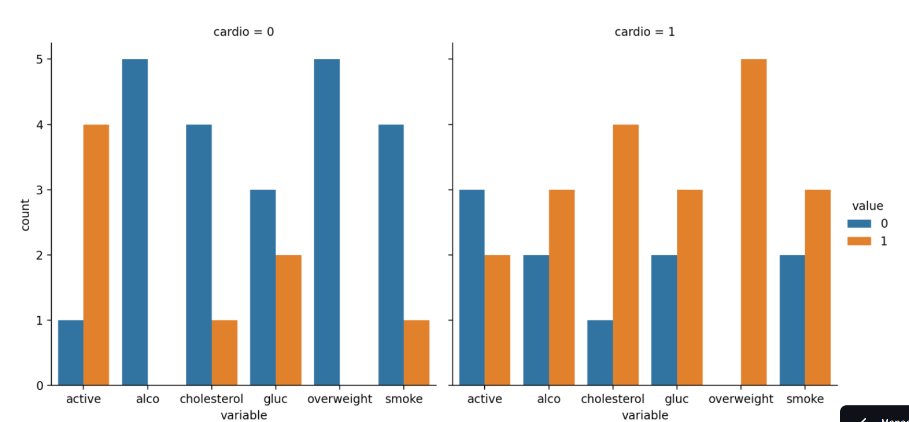

# 🩺 Medical Data Visualizer

A powerful and interactive **Streamlit web application** for analyzing medical examination data and visualizing important health indicators.

🚀 **Live App:** (https://medical-data-visualizer-brmhrdgpuntyra2snp8hav.streamlit.app/)  

---

## 📌 Overview

This project allows users to upload a medical dataset and explore relationships between different health features such as:

- Age, weight, height
- Blood pressure (ap_hi, ap_lo)
- Cholesterol & glucose levels
- Lifestyle factors (smoking, alcohol, activity)
- Cardiovascular disease (cardio)

The app provides **visual insights** using correlation heatmaps and categorical plots.

---

## ✨ Features

- 📂 Upload custom CSV dataset  
- 🧹 Automatic data cleaning & preprocessing  
- ⚖️ BMI calculation (Overweight detection)  
- 🔄 Normalization of cholesterol & glucose  
- 🔥 Correlation Heatmap  
- 📊 Categorical Plot (Cardio vs Features)  
- ⚡ Fast & interactive UI using Streamlit  

---

## 🛠️ Tech Stack

---

## 📂 Dataset Format

Your dataset should contain the following columns:

| Column        | Description |
|--------------|------------|
| age          | Age (in days) |
| height       | Height (cm) |
| weight       | Weight (kg) |
| gender       | 1 = female, 2 = male |
| ap_hi        | Systolic blood pressure |
| ap_lo        | Diastolic blood pressure |
| cholesterol  | Cholesterol level |
| gluc         | Glucose level |
| smoke        | Smoking status |
| alco         | Alcohol consumption |
| active       | Physical activity |
| cardio       | Cardiovascular disease (target) |

---

## ⚙️ How It Works

1. Upload your dataset (CSV)  
2. The app:
   - Cleans the data  
   - Calculates BMI → overweight  
   - Normalizes cholesterol & glucose  
3. Generates:
   - 🔥 Correlation Heatmap  
   - 📊 Categorical Plot  

---

## 🎥 Demo (GIF)

---

## 📸 Screenshots

### 📂 Upload Interface

---

### 📊 Dataset Preview

---

### 🔥 Correlation Heatmap

---

### 📊 Categorical Plot

---

